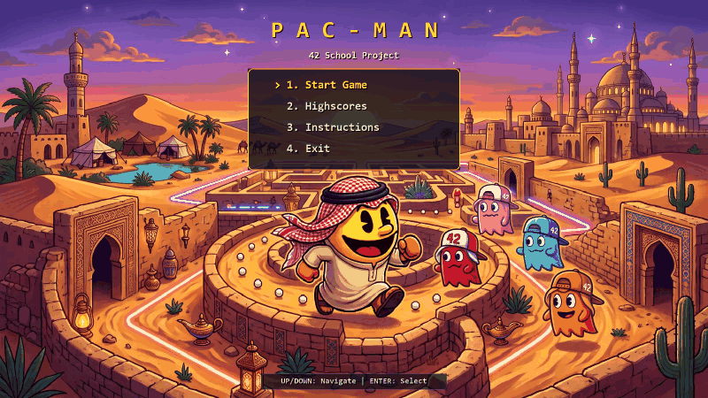
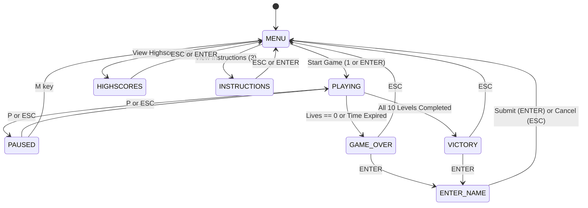
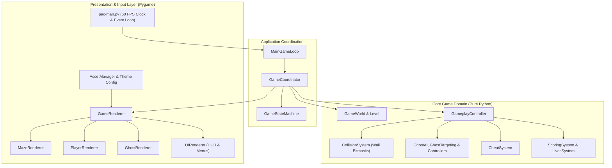

*This activity has been created as part of the 42 curriculum by borabi, hqasqas.*

# Pac-Man — 42 School Project

[](https://www.python.org/)
[](https://flake8.pycqa.org/)
[](http://mypy-lang.org/)
[](https://docs.pytest.org/)

A full-featured, architecturally decoupled implementation of the classic **Pac-Man** arcade game.

---



---

## 1. Project Description

This project faithfully recreates the iconic Pac-Man arcade experience across **10 procedurally generated maze levels**. The architecture strictly honors the core **Golden Rule**:

> **"Pygame displays the game; Pygame does not define the game."**

All game logic—including entity movements, bitmask corridor collisions, ghost pathfinding AI, state machine transitions, scoring rules, lives deduction, timers, cheats, and high scores—resides entirely within pure Python domain modules. Pygame is restricted strictly to presentation (rendering surfaces and blitting graphics) and input polling.

### Key Highlights
- **10 Unique Levels**: Procedural generation utilizing the mandatory external `mazegenerator` wheel with `perfect=False`.
- **Intelligent Ghost AI**: Differentiated ghost personalities (Red direct chase, Pink predictive ambush, Blue flanker, Orange cautious chaser) with Chase, Flee, and Return-Home states powered by BFS corridor shortest-path graph intelligence.
- **Fault-Tolerant Configuration**: JSON parser supporting comments (`#` and `//`) with automatic safe default clamping for invalid or missing values.
- **Native Fixed $1600 \times 900$ Display**: Single native widescreen resolution eliminating window stretching and OS resizing flicker, with mazes auto-scaled and centered.
- **Custom Arabian Desert Theme**: Fully realized visual identity featuring Shemagh-clad Pac-Man with 4-directional 3-frame chomping animations, 42-capped ghost personalities, Arabian Date pellets, and glowing Dallah super-pellets powered by the decoupled `AssetManager`.
- **Centralized Silent Logging**: All library warnings, dimensional clamping notices, and `stderr` streams route exclusively to `errors.log`, keeping terminal console output completely silent.
- **Cheat Subsystem**: Real-time hotkeys for evaluation and debugging (Invincibility, Freeze Ghosts, Speed Boost, Extra Lives, Level Skip).
- **Persistent High Scores**: Top 10 leaderboard persisted to JSON with flexible name validation (1 to 10 characters: uppercase, lowercase, digits, spaces).
- **Theme & Asset Separation**: Visuals, fonts, and sounds are isolated through an `AssetManager` with procedural fallbacks.
- **Platform Packaging**: Standalone distribution packaging for itch.io and Steam (`dist/pacman_release.zip`, 1.49 MB).

---

## 2. Instructions

### Prerequisites
- Python 3.10 or higher.
- [uv](https://docs.astral.sh/uv/) (recommended) or standard `pip`.

### Quick Start with `uv`
```bash
# 1. Install dependencies
make install
# or: uv sync

# 2. Run the game with the configuration file
make run
# or: uv run python pac-man.py config.json
```

### Quick Start with Standard Python
```bash
# 1. Create virtual environment and install dependencies
python -m venv .venv
source .venv/bin/activate  # On Windows: .venv\Scripts\activate
pip install -r requirements.txt
pip install libs/mazegenerator-2.1.0-py3-none-any.whl

# 2. Run the game
python pac-man.py config.json
```

### Controls

| Action | Primary Key | Secondary Key | Context |
| :--- | :--- | :--- | :--- |
| **Move Up** | `UP Arrow` | `W` | Active Gameplay |
| **Move Down** | `DOWN Arrow` | `S` | Active Gameplay |
| **Move Left** | `LEFT Arrow` | `A` | Active Gameplay |
| **Move Right** | `RIGHT Arrow` | `D` | Active Gameplay |
| **Pause / Resume** | `P` | `ESCAPE` | Active Gameplay / Paused |
| **Return to Menu** | `M` | `ESCAPE` | Paused / Game Over / Victory |
| **Navigate Menu** | `UP` / `DOWN` | `1`, `2`, `3`, `4` | Main Menu |
| **Select / Confirm** | `ENTER` | `SPACE` | Menus / Game Over / Victory |
| **Submit High Score** | `ENTER` | — | Name Entry Screen |

### Cheat Hotkeys (Active Gameplay)

| Key | Cheat Function | Description |
| :---: | :--- | :--- |
| **`1`** | **Toggle Invincibility** | Pac-Man becomes immune to ghost damage. |
| **`2`** | **Toggle Freeze Ghosts** | All ghosts are frozen in place. |
| **`3`** | **Toggle Speed Boost** | Doubles Pac-Man's movement speed. |
| **`4`** | **Extra Life (+1)** | Immediately grants one additional life. |
| **`5`** | **Skip Level** | Instantly completes the current level. |

---

## 3. Resources and AI Usage

- **Libraries**:
  - `pygame` (presentation, surface blitting, audio, font rendering).
  - `mazegenerator` wheel (`libs/mazegenerator-2.1.0-py3-none-any.whl`) used as-is.
  - `pytest`, `flake8`, `mypy` (verification and testing).
- **AI Collaboration**:
  - AI assisted in auditing architectural boundaries, verifying bitmask boundary wall collision logic, refactoring procedural rendering fallbacks, and maintaining complete static type annotations.
  - All generated code was verified with 525 automated tests, strict `flake8` compliance (0 warnings), and zero-defect `mypy` type checking.

---

## 4. Configuration

Gameplay is fully configurable via `config.json`. The configuration loader is **100% fault-tolerant**: lines beginning with `#` or `//` are treated as comments, unknown keys are ignored, and any missing or invalid values automatically clamp to robust defaults without crashing or outputting tracebacks.

### Configuration Parameters

| Parameter | Type | Default | Description |
| :--- | :---: | :---: | :--- |
| `highscore_filename` | `str` | `"highscores.json"` | Destination path for high-score leaderboard file. |
| `lives` | `int` | `3` | Starting lives count for Pac-Man (minimum `1`). |
| `pacgum` | `int` | `42` | Total pacgums distributed across maze corridors. |
| `points_per_pacgum` | `int` | `10` | Base score awarded for consuming a regular pellet. |
| `points_per_super_pacgum` | `int` | `50` | Score awarded for devouring a corner super-pacgum. |
| `points_per_ghost` | `int` | `200` | Score awarded for eating a frightened ghost. |
| `level_max_time` | `int` | `90` | Maximum time allowed (in seconds) to complete each level. |
| `power_mode_duration` | `float` | `7.0` | Duration (in seconds) of Power Mode upon eating super-pacgum. |
| `seed` | `int` | `42` | Base pseudo-random seed used for maze generation. |
| `levels` | `list` | *10 levels* | List of level configurations (`width`, `height`). |

### Maze Dimension Boundaries & Validation
- **Minimum Dimensions**: $5 \times 5$ (ensures space for 4 corner spawns, center player spawn, and corridor pacgums).
- **Maximum Dimensions**: $35 \times 24$ (ensures seamless rendering inside the fixed $1600 \times 900$ native display window).
- **Fault-Tolerant Fallback**: If any level specifies dimensions outside $5 \le \text{width} \le 35$ or $5 \le \text{height} \le 24$, an informative timestamped warning is appended to `errors.log` and the level safely defaults to $19 \times 21$ without crashing or skipping levels.
- **Silent Terminal Execution**: The application routes all external library messages (such as `mazegenerator` notices), JSON parsing warnings, and dimension warnings directly into `errors.log`, leaving terminal console stdout and stderr completely clean.

### Engine-Locked Speeds (Optional in JSON)
To guarantee predictable 60 FPS sub-tile physics and arcade pacing, movement speeds are permanently locked to engine constants and decoupled from user JSON inputs:
- `player_speed`: `2.1429` tiles/second
- `ghost_speed`: `1.8214` tiles/second (~85% of player speed)
- `frightened_ghost_speed`: `1.0714` tiles/second (~50% of ghost speed)
- `returning_ghost_speed`: `3.5` tiles/second (rapid return to base)

Speed keys in `config.json` are **completely optional**; omitting them has zero negative effect, and any speed values provided in JSON are safely ignored in favor of calibrated physics constants.

---

## 5. Highscore System

- **Persistence**: High scores are stored persistently on disk in `highscores.json`.
- **Capacity**: Maintains the **top 10** highest scores sorted in descending order.
- **Name Validation**: Player names are flexible (1 to 10 characters), accepting uppercase letters (`A-Z`), lowercase letters (`a-z`), numbers (`0-9`), and spaces. Empty or whitespace-only names are rejected.
- **Zero-Corruption Guard**: If the high score file is missing, corrupt, or contains invalid data, the manager safely initializes with an empty leaderboard without raising unhandled errors.

---

## 6. Maze Generation

Mazes are generated using the mandatory wheel `libs/mazegenerator-2.1.0-py3-none-any.whl` called with `perfect=False` to produce imperfect mazes containing loops and multiple paths.

### Bitmask Representation
The external wheel represents cell boundary walls as directional bitmasks:
- `NORTH = 1`
- `EAST  = 2`
- `SOUTH = 4`
- `WEST  = 8`

`MazeAdapter` converts these raw bitmasks into typed domain `Cell` and `Maze` structures. Boundary collisions inspect these bitmasks to ensure that entities navigate corridors cleanly and cannot pass through solid walls.

### Spawn Locations
- **Player (Pac-Man)**: Spawns in the **center** of the maze (`width // 2, height // 2`). When the exact center collides with a solid cell of the mandatory "42" pattern (which occurs at `width = 14`), `MazeAdapter` automatically resolves Pac-Man's spawn inward to the nearest open corridor cell `(6, 5)`, ensuring complete DFS wall carving and zero collision lock.
- **4 Ghosts**: Spawn in the **four corners** of the maze.
- **Super-Pacgums**: Placed in the **four corners** of the maze.
- **Pacgums**: Distributed across open corridors.

---

## 7. Implementation & Gameplay Mechanics



### Ghost Personalities
- **Blinky (Red)**: Aggressive direct chaser using BFS corridor shortest-path graph intelligence to pursue Pac-Man relentlessly through all maze bends without getting stuck behind walls.
- **Pinky (Pink)**: Ambush predictor targeting 4 tiles ahead of Pac-Man's orientation vector with BFS corridor pathfinding.
- **Inky (Blue)**: Flanker using a pivot 2 tiles ahead of Pac-Man reflected across Blinky's position with BFS corridor navigation.
- **Clyde (Orange)**: Distance-sensitive chaser: pursues Pac-Man via BFS when farther than 8 tiles away, retreating to home corner when within 8 tiles.

### Power Mode
- Consuming a super-pacgum awards +50 points and triggers Power Mode for `power_mode_duration` seconds.
- Ghosts transition to `FLEE` mode (crying frightened sprite).
- Pac-Man contacting a fleeing ghost consumes it for +200 points. The ghost transitions to `RETURN_HOME` mode (eyes only) and heads to its home corner to respawn.

---

## 8. General Software Architecture

The codebase follows a modular clean architecture where presentation is strictly decoupled from domain logic:



### Theme & Asset Separation: The Arabian Desert Theme
Visual and audio assets are strictly centralized in `AssetManager` (`src/theme/asset_manager.py`). Changing visual themes only requires modifying asset configurations—**never** the gameplay entities or systems.

The default presentation showcases a custom, fully realized **Arabian Desert Theme**:
- **Pac-Man**: Features custom Arabian attire (Shemagh, Agal, and white Thobe) with smooth 4-directional 3-frame chomping animations (`pacman-up`, `pacman-down`, `pacman-left`, `pacman-right`) smoothly scaled to any cell dimension.
- **Ghosts**: Differentiated ghost personalities sporting custom "42" trucker caps (`ghost_red.png`, `ghost_pink.png`, `ghost_blue.png`, `ghost_orange.png`) and a meme crying frightened ghost sprite (`ghost_frightened.png`).
- **Pellets & Environment**: Golden-brown Arabian Dates (Tamr) for pacgums, glowing emerald-inlaid Saudi Dallah coffee pots for super-pacgums, and sandstone desert brick blocks for walls.
- **Atmospheric Backdrops**: Starry Arabian Desert Night in-game playing background (`game_background.jpg`), triumphant Palace Terrace Fireworks victory screen (`victory_background.jpg`), and comic desert camp defeat game over screen (`game_over_background.jpg`) with matching frosted-glass name entry cards.

---

## 9. Project Management

Comprehensive project management documentation and artifacts are located in [`docs/project_management/`]

- [`timeline_gantt.md`] Project milestones, Gantt chart, and Kanban workflow stages.
- [`progress_tracking.md`] Baseline estimation vs actual timeline analysis and burn-down chart.
- [`risk_analysis.md`] Comprehensive risk matrix, severity ratings, and technical mitigations.
- [`team_organization.md`] Team roles (`borabi`, `hqasqas`), pair-programming practices, and Architectural Decision Records (ADR-001 to ADR-010).
- [`acceptance_test_plan.md`] Acceptance test matrix, traceability mapping, manual test scenarios, and bug tracking log.

---

## 10. Verification & Quality Assurance

The codebase strictly adheres to 42 School software standards:

```bash
# Run the complete test suite (525 passed in ~1.0s)
uv run pytest

# Check style compliance (0 warnings across repository)
uv run flake8 --exclude .venv,dist .

# Check static typing compliance (0 errors across 78 source files)
uv run mypy --warn-return-any --warn-unused-ignores --ignore-missing-imports --disallow-untyped-defs --check-untyped-defs src/ pac-man.py package.py

# Build standalone distribution package (dist/pacman_release.zip, 1.49 MB)
uv run python package.py
```

---

## 11. Authors

- **Bilal Orabi** (`borabi`) — Architecture, Systems & Ghost AI
- **Hamza Qasqas** (`hqasqas`) — Presentation, UI & Packaging
