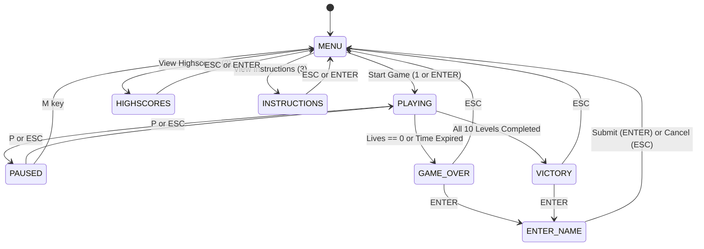

*This activity has been created as part of the 42 curriculum by borabi, hqasqas.*

# Pac-Man — 42 School Project

[](https://www.python.org/)
[](https://flake8.pycqa.org/)
[](http://mypy-lang.org/)
[](https://docs.pytest.org/)

A full-featured, architecturally decoupled implementation of the classic **Pac-Man** arcade game, developed as part of the **42 School curriculum**.

---

## 1. Project Description

This project faithfully recreates the iconic Pac-Man arcade experience across **10 procedurally generated maze levels**. The architecture strictly honors the core **Golden Rule**:

> **"Pygame displays the game; Pygame does not define the game."**

All game logic—including entity movements, bitmask corridor collisions, ghost pathfinding AI, state machine transitions, scoring rules, lives deduction, timers, cheats, and high scores—resides entirely within pure Python domain modules. Pygame is restricted strictly to presentation (rendering surfaces and blitting graphics) and input polling.

### Key Highlights
- **10 Unique Levels**: Procedural generation utilizing the mandatory external `mazegenerator` wheel with `perfect=False`.
- **Intelligent Ghost AI**: Differentiated ghost personalities (Red direct chase, Pink predictive ambush, Blue flanker, Orange cautious chaser) with Chase, Flee, and Return-Home states.
- **Fault-Tolerant Configuration**: JSON parser supporting comments (`#` and `//`) with automatic safe default clamping for invalid or missing values.
- **Cheat Subsystem**: Real-time hotkeys for evaluation and debugging (Invincibility, Freeze Ghosts, Speed Boost, Extra Lives, Level Skip).
- **Persistent High Scores**: Top 10 leaderboard persisted to JSON with strict name validation (max 10 alphanumeric characters).
- **Theme & Asset Separation**: Visuals, fonts, and sounds are isolated through an `AssetManager` with procedural fallbacks.
- **Platform Packaging**: Standalone distribution packaging for itch.io and Steam.

---

## 2. Instructions

### Prerequisites
- Python 3.10 or higher.
- [uv](https://docs.astral.sh/uv/) (recommended) or standard `pip`.

### Quick Start with `uv`
```bash
# 1. Install dependencies
make install
# or: uv sync

# 2. Run the game with the configuration file
make run
# or: uv run python pac-man.py config.json
```

### Quick Start with Standard Python
```bash
# 1. Create virtual environment and install dependencies
python -m venv .venv
source .venv/bin/activate  # On Windows: .venv\Scripts\activate
pip install -r requirements.txt
pip install libs/mazegenerator-2.1.0-py3-none-any.whl

# 2. Run the game
python pac-man.py config.json
```

### Controls

| Action | Primary Key | Secondary Key | Context |
| :--- | :--- | :--- | :--- |
| **Move Up** | `UP Arrow` | `W` | Active Gameplay |
| **Move Down** | `DOWN Arrow` | `S` | Active Gameplay |
| **Move Left** | `LEFT Arrow` | `A` | Active Gameplay |
| **Move Right** | `RIGHT Arrow` | `D` | Active Gameplay |
| **Pause / Resume** | `P` | `ESCAPE` | Active Gameplay / Paused |
| **Return to Menu** | `M` | `ESCAPE` | Paused / Game Over / Victory |
| **Navigate Menu** | `UP` / `DOWN` | `1`, `2`, `3`, `4` | Main Menu |
| **Select / Confirm** | `ENTER` | `SPACE` | Menus / Game Over / Victory |
| **Submit High Score** | `ENTER` | — | Name Entry Screen |

### Cheat Hotkeys (Active Gameplay)

| Key | Cheat Function | Description |
| :---: | :--- | :--- |
| **`1`** | **Toggle Invincibility** | Pac-Man becomes immune to ghost damage. |
| **`2`** | **Toggle Freeze Ghosts** | All ghosts are frozen in place. |
| **`3`** | **Toggle Speed Boost** | Doubles Pac-Man's movement speed. |
| **`4`** | **Extra Life (+1)** | Immediately grants one additional life. |
| **`5`** | **Skip Level** | Instantly completes the current level. |

---

## 3. Resources and AI Usage

- **Curriculum Subject**: 42 School Pac-Man Project Specification.
- **Libraries**:
  - `pygame` (presentation, surface blitting, audio, font rendering).
  - `mazegenerator` wheel (`libs/mazegenerator-2.1.0-py3-none-any.whl`) used as-is.
  - `pytest`, `flake8`, `mypy` (verification and testing).
- **AI Collaboration**:
  - AI assisted in auditing architectural boundaries, verifying bitmask boundary wall collision logic, refactoring procedural rendering fallbacks, and maintaining complete static type annotations.
  - All generated code was verified with 480 automated tests, strict `flake8` compliance (0 warnings), and zero-defect `mypy` type checking.

---

## 4. Configuration

Gameplay is fully configurable via `config.json`. The configuration loader is **100% fault-tolerant**: lines beginning with `#` or `//` are treated as comments, unknown keys are ignored, and any missing or invalid values automatically clamp to robust defaults without crashing or outputting tracebacks.

### Configuration Parameters

| Parameter | Type | Default | Description |
| :--- | :---: | :---: | :--- |
| `lives` | `int` | `3` | Starting lives count for Pac-Man. |
| `pacgum` | `int` | `42` | Total pacgums distributed across maze corridors. |
| `points_per_pacgum` | `int` | `10` | Base score awarded for consuming a regular pellet. |
| `level_max_time` | `float` | `90.0` | Maximum time allowed (in seconds) to complete each level. |
| `player_speed` | `float` | `1.0` | Base movement speed factor for Pac-Man. |
| `ghost_speed` | `float` | `0.9` | Movement speed factor for normal chasing ghosts. |
| `frightened_ghost_speed` | `float` | `0.6` | Movement speed factor for frightened (edible) ghosts. |
| `returning_ghost_speed` | `float` | `1.5` | Movement speed factor for eyes returning to home base. |
| `power_mode_duration` | `float` | `10.0` | Duration (in seconds) of Power Mode upon super-pacgum eating. |
| `seed` | `int` | `42` | Base pseudo-random seed used for maze generation. |
| `levels` | `list` | *10 levels* | List of level configurations (`width`, `height`, `wall_density`). |

---

## 5. Highscore System

- **Persistence**: High scores are stored persistently on disk in `highscores.json`.
- **Capacity**: Maintains the **top 10** highest scores sorted in descending order.
- **Name Validation**: Player names are strictly limited to **1 to 10 characters**, containing only alphanumeric characters and spaces. Empty or whitespace-only names are rejected.
- **Zero-Corruption Guard**: If the high score file is missing, corrupt, or contains invalid data, the manager safely initializes with an empty leaderboard without raising unhandled errors.

---

## 6. Maze Generation

Mazes are generated using the mandatory wheel `libs/mazegenerator-2.1.0-py3-none-any.whl` called with `perfect=False` to produce imperfect mazes containing loops and multiple paths.

### Bitmask Representation
The external wheel represents cell boundary walls as directional bitmasks:
- `NORTH = 1`
- `EAST  = 2`
- `SOUTH = 4`
- `WEST  = 8`

`MazeAdapter` converts these raw bitmasks into typed domain `Cell` and `Maze` structures. Boundary collisions inspect these bitmasks to ensure that entities navigate corridors cleanly and cannot pass through solid walls.

### Spawn Locations
- **Player (Pac-Man)**: Spawns in the **center** of the maze (`width // 2, height // 2`).
- **4 Ghosts**: Spawn in the **four corners** of the maze.
- **Super-Pacgums**: Placed in the **four corners** of the maze.
- **Pacgums**: Distributed across open corridors.

---

## 7. Implementation & Gameplay Mechanics



### Ghost Personalities
- **Blinky (Red)**: Direct aggressive pursuit targeting Pac-Man's exact grid cell.
- **Pinky (Pink)**: Ambush behavior targeting cells ahead of Pac-Man's current direction.
- **Inky (Blue)**: Flanking behavior using a vector from Blinky through Pac-Man.
- **Clyde (Orange)**: Distance-sensitive behavior: chases Pac-Man when far, retreats to home corner when within 4 cells.

### Power Mode
- Consuming a super-pacgum awards +50 points and triggers Power Mode for `power_mode_duration` seconds.
- Ghosts transition to `FLEE` mode (blue visual).
- Pac-Man contacting a fleeing ghost consumes it for +200 points. The ghost transitions to `RETURN_HOME` mode (eyes only) and heads to its home corner to respawn.

---

## 8. General Software Architecture

The codebase follows a modular clean architecture where presentation is strictly decoupled from domain logic:

```mermaid
flowchart TD
    subgraph Presentation Layer [Presentation & Input Layer (Pygame)]
        LOOP[MainGameLoop / 60 FPS Clock]
        R_GAME[GameRenderer]
        R_MAZE[MazeRenderer]
        R_PLAYER[PlayerRenderer]
        R_GHOST[GhostRenderer]
        R_UI[UIRenderer - HUD & Menus]
        AM[AssetManager & Theme Config]
    end

    subgraph Application Layer [Application Coordination]
        GC[GameCoordinator]
        SM[GameStateMachine]
    end

    subgraph Domain Tier [Core Game Domain (Pure Python)]
        WORLD[GameWorld & Level]
        CONTROLLER[GameplayController]
        COLLISION[CollisionSystem - Wall Bitmasks]
        AI[GhostAI & Controllers]
        CHEAT[CheatSystem]
        SCORES[ScoringSystem & LivesSystem]
    end

    LOOP --> GC
    GC --> SM
    GC --> WORLD
    GC --> CONTROLLER
    GC --> R_GAME
    R_GAME --> R_MAZE
    R_GAME --> R_PLAYER
    R_GAME --> R_GHOST
    R_GAME --> R_UI
    AM --> R_GAME
    CONTROLLER --> COLLISION
    CONTROLLER --> AI
    CONTROLLER --> CHEAT
    CONTROLLER --> SCORES
```

### Theme & Asset Separation
Visual and audio assets are centralized in `AssetManager` (`src/theme/asset_manager.py`). Changing visual themes (Classic, Cyberpunk, Runeterra) only requires modifying asset configurations—**never** the gameplay entities or systems.

---

## 9. Project Management

Comprehensive project management documentation and artifacts are located in [`docs/project_management/`](file:///d:/pacman/docs/project_management/):

- [`timeline_gantt.md`](file:///d:/pacman/docs/project_management/timeline_gantt.md): Project milestones, Gantt chart, and Kanban workflow stages.
- [`progress_tracking.md`](file:///d:/pacman/docs/project_management/progress_tracking.md): Baseline estimation vs actual timeline analysis and burn-down chart.
- [`risk_analysis.md`](file:///d:/pacman/docs/project_management/risk_analysis.md): Comprehensive risk matrix, severity ratings, and technical mitigations.
- [`team_organization.md`](file:///d:/pacman/docs/project_management/team_organization.md): Team roles (`borabi`, `hqasqas`), pair-programming practices, and Architectural Decision Records (ADR-001 to ADR-006).
- [`acceptance_test_plan.md`](file:///d:/pacman/docs/project_management/acceptance_test_plan.md): Acceptance test matrix, traceability mapping, manual test scenarios, and bug tracking log.

---

## 10. Verification & Quality Assurance

The codebase strictly adheres to 42 School software standards:

```bash
# Run the complete test suite (480 passed)
uv run pytest

# Check style compliance (0 warnings)
uv run flake8 --exclude .venv .

# Check static typing compliance (0 errors)
uv run mypy --warn-return-any --warn-unused-ignores --ignore-missing-imports --disallow-untyped-defs --check-untyped-defs src/

# Build standalone distribution package
uv run python package.py
```

---

## 11. Authors

- **Bilal Orabi** (`borabi`) — Architecture, Systems & Ghost AI
- **Hamza Qasqas** (`hqasqas`) — Presentation, UI & Packaging
