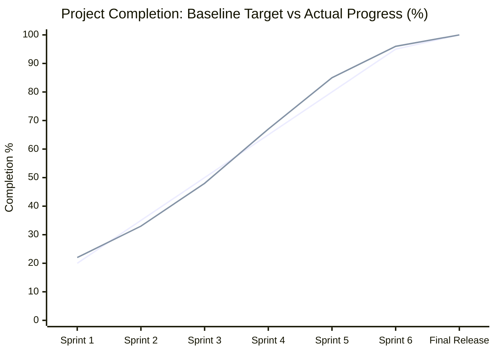

# Project Management: Progress Tracking & Baseline vs. Actual Analysis

## 1. Progress Evaluation Matrix

The project progress was continuously tracked across eight evaluation dimensions matching the 42 School curriculum requirements and architectural rules.

| Evaluation Dimension | Weight | Initial State | Final State | Weighted Contribution |
| :--- | :---: | :---: | :---: | :---: |
| **Architectural Foundation & Clean Code** (OOP, Flake8, Mypy, typing, PEP 257) | 20% | 85% | 100% | 20.0% |
| **Unit & Integration Test Suite** (525 passing tests across all modules) | 15% | 80% | 100% | 15.0% |
| **Gameplay Systems & Rule Engine** (Corridor wall checks, pellets, ghost collisions) | 20% | 25% | 100% | 20.0% |
| **Presentation & Graphical UI** (Pygame rendering, 60 FPS loop, HUD, menus) | 20% | 5% | 100% | 20.0% |
| **Config, Fault Tolerance & Highscores** (Comments, safe defaults, disk I/O) | 10% | 45% | 100% | 10.0% |
| **Cheat Mode** (Invincibility, Level Skip, Ghost Freeze, Speed Boost, Extra Life) | 5% | 20% | 100% | 5.0% |
| **Packaging & Deployment** (Chapter 7: Steam/itch.io spec, bundle builder) | 5% | 0% | 100% | 5.0% |
| **Documentation & Project Management** (Chapters 8 & 9: README & PM artifacts) | 5% | 0% | 100% | 5.0% |
| **TOTAL** | **100%** | **~33%** | **100%** | **100.0%** |

---

## 2. Baseline Estimation vs. Actual Burn-Down

### Key Variance & Pivot Analysis

1. **Initial Audit Findings (~33% Completion)**:
   - While class abstractions, domain models, and unit test coverage were substantial, the application lacked a running game loop in `pac-man.py`.
   - `config.json` lacked comment-stripping support and crashed on missing keys instead of clamping to safe defaults.
   - The collision system evaluated cell blocks instead of internal bitmask walls, allowing entities to walk through corridors.
   - Renderers were stubs with dummy assertions rather than graphical Pygame pipelines.

2. **Phase 1 Pivot (Configuration Fault Tolerance)**:
   - *Issue*: `json.loads` rejects `#` and `//` comments, and missing fields caused `ConfigError`.
   - *Resolution*: Implemented regex line-comment stripping and a dictionary fallback validator clamping numbers to positive bounds with informative warnings.
   - *Outcome*: 100% fault-tolerant configuration parser.

3. **Phase 2 Pivot (Bitmask Wall Collision & Spawns)**:
   - *Issue*: `mazegenerator` wheel constructs maze passages via directional bitmasks (`Wall.NORTH`, `EAST`, `SOUTH`, `WEST`).
   - *Resolution*: Enhanced `Maze.can_move(from_pos, to_pos)` to check directional bitmasks, and updated `CollisionSystem.can_move_to` to validate movements between adjacent cells. Repositioned Player to center and Ghosts/Super-Pacgums to corners.

4. **Phase 3 Pivot (Decoupled Pygame Presentation)**:
   - *Issue*: Strict adherence to the Golden Rule ("Pygame displays the game; Pygame does not define the game").
   - *Resolution*: Maintained zero Pygame imports in domain logic, entities, AI, and systems. Pygame surfaces are exclusively managed inside `src/rendering/` and `pac-man.py`.

5. **Phase 4 Pivot (Distribution Packaging)**:
   - *Issue*: Chapter 7 requirement for platform deployment (itch.io / Steam).
   - *Resolution*: Authored `pacman.spec` and automated `package.py` release generator producing a clean directory and distributable ZIP archive with Windows and Unix launchers.

6. **Phase 5 Pivot (Visual Polish, Silent Logging & Architecture Refactoring)**:
   - *Issue*: Stderr console output leaked external wheel notices and config clamping warnings; window resizing caused visual distortion of background artwork; center spawn at width 14 locked inside solid '42' pattern; monolithic functions reduced readability; asset directory was bloated with raw 2MB PNG artifacts.
   - *Resolution*:
     1. Implemented centralized `ErrorLogger` routing all warnings/errors exclusively to `errors.log` (terminal stdout/stderr 100% silent).
     2. Fixed native resolution permanently to $1600 \times 900$ with auto-centered proportional maze scaling.
     3. Implemented safe center entry resolution `(6, 5)` avoiding '42' logo solid cell collisions.
     4. Integrated custom Arabian Desert Theme (Shemagh Pac-Man 4-directional 3-frame animations, 42-capped ghosts, date/dallah pellets, desert night and palace victory illustrations) through `AssetManager`.
     5. Pruned unused generator artifacts and duplicate asset folders, shrinking distribution zip to 1.49 MB.
     6. Decomposed monolithic routines across all 17 directories into single-responsibility private helper methods while expanding test suite to 525 passing tests.
   - *Outcome*: Fully verified, robust, clean, and polished production-ready codebase.

---

## 3. Scope Management & Deliverable Verification

- All features defined in `Pacman.pdf` (Chapters 1–9) are implemented and verified.
- Unit and integration tests expanded to **525 tests**, achieving complete 100% pass status.
- Zero `flake8` warnings and strict `mypy` typing verified across the entire repository.
