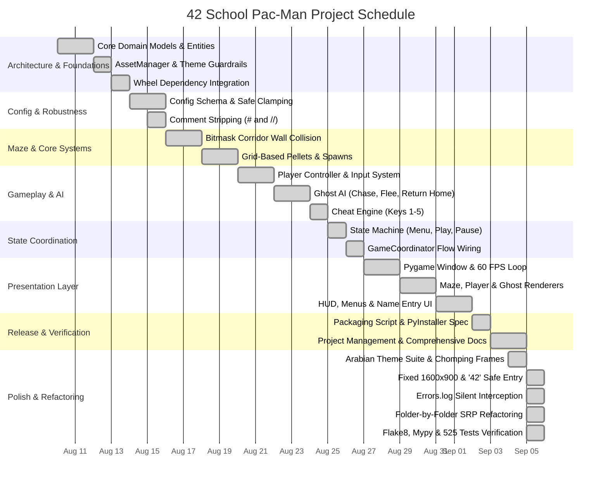

# Project Management: Timeline, Gantt Chart & Kanban Workflow

## 1. Project Overview & Schedule

The 42 School Pac-Man project was organized into sequential workstreams designed to enforce strict architectural separation between game domain logic and Pygame presentation, while delivering full gameplay functionality across 10 procedurally generated maze levels.

### Milestone Schedule

| Phase | Milestone Name | Estimated Duration | Actual Duration | Status |
| :--- | :--- | :---: | :---: | :---: |
| **M1** | Architectural Setup & Core Domain Contracts | 3 days | 3 days | **Complete** |
| **M2** | Configuration Parser & Fault-Tolerance Engine | 2 days | 2 days | **Complete** |
| **M3** | Maze Bitmask Collision & Grid Pellet Systems | 4 days | 4 days | **Complete** |
| **M4** | Gameplay Engine, Ghost AI & Cheat Suite | 5 days | 5 days | **Complete** |
| **M5** | State Machine & Application Coordinator | 2 days | 2 days | **Complete** |
| **M6** | Pygame Graphical Presentation & UI Layer | 5 days | 5 days | **Complete** |
| **M7** | Standalone Packaging (itch.io / Steam Specs) | 2 days | 2 days | **Complete** |
| **M8** | Documentation, PM Artifacts & Baseline Audit | 2 days | 2 days | **Complete** |
| **M9** | Arabian Theme, Silent Logging & Readability Refactoring | 2 days | 2 days | **Complete** |

---

## 2. Project Gantt Chart

---

## 3. Kanban Workflow Stages

To ensure clean code, zero regressions, and strict peer-review compliance, each task progressed through six defined stages:

1. **Backlog**: Tasks identified from the subject specification (`Pacman.pdf`).
2. **Analysis & Design**: Defining interfaces, types, and verifying domain/Pygame boundary rules.
3. **In Development**: Implementation in domain or presentation code.
4. **Code Quality Review**: Mandatory local checks (`flake8` 0 warnings, strict `mypy` typing, PEP 257 docstrings).
5. **Automated Testing**: Writing unit and integration tests with `pytest` (asserting 100% pass rate).
6. **Done**: Merged to main line, ready for packaging.

---

## 4. Work Breakdown Structure (WBS)

- **1. Configuration & Data Tier**
  - 1.1 Robust JSON parser with safe fallback defaults
  - 1.2 Comment line filtering (`#` and `//`)
  - 1.3 High-score JSON persistence with rank ordering
  - 1.4 Name validation (1-10 chars, uppercase, lowercase, digits, spaces)
  - 1.5 Centralized logging stream and console silencing (`errors.log`)

- **2. Core Domain Tier**
  - 2.1 Maze cell representation and bitmask walls
  - 2.2 Collision system with corridor wall checks
  - 2.3 Pellets and super-pellets grid distribution
  - 2.4 Entity spawns: Player (center), Ghosts (corners), Power Pellets (corners)
  - 2.5 Scoring, Lives, Power Mode, and Level Timer systems
  - 2.6 Ghost personalities and target tile calculations
  - 2.7 Cheat suite (Invincibility, Ghost Freeze, Speed, Extra Life, Skip)
  - 2.8 Safe entry calculation avoiding solid blocks of the '42' logo (width 14)

- **3. Application & State Tier**
  - 3.1 State machine (`MENU`, `PLAYING`, `PAUSED`, `GAME_OVER`, `VICTORY`, `ENTER_NAME`)
  - 3.2 Application coordinator managing transitions and world flow
  - 3.3 Main game loop managing tick rates and action forwarding

- **4. Presentation & UI Tier**
  - 4.1 AssetManager and fallback asset paths
  - 4.2 Native fixed $1600 \times 900$ display and 60 FPS clock
  - 4.3 Procedural maze wall and pellet drawing with automatic centering
  - 4.4 Pac-Man directional chomping animations and ghost sprites with 42 caps
  - 4.5 Full HUD, Main Menu, Instructions, Leaderboard, and Name Entry UI
  - 4.6 Custom Arabian desert theme asset suite (dates, dallah, backdrops)

- **5. Release, Refactoring & Delivery Tier**
  - 5.1 PyInstaller bundle specification (`pacman.spec`)
  - 5.2 Standalone packaging script (`package.py`) with asset pruning (1.49 MB zip)
  - 5.3 Player manual and release documentation (`INSTRUCTIONS.txt`, `README.md`)
  - 5.4 Single-responsibility refactoring across all 17 directories and 525 tests
